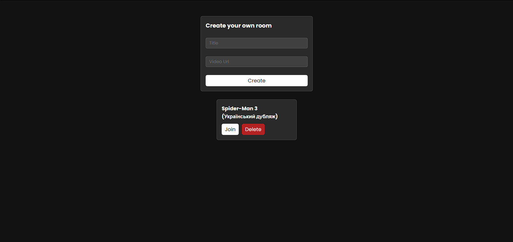
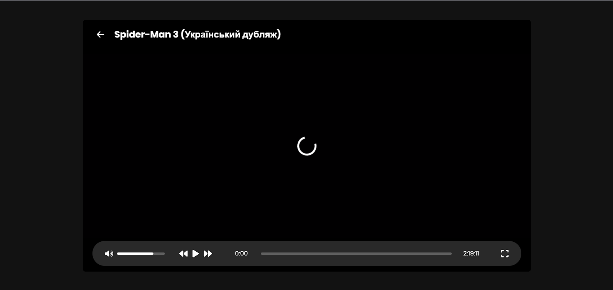
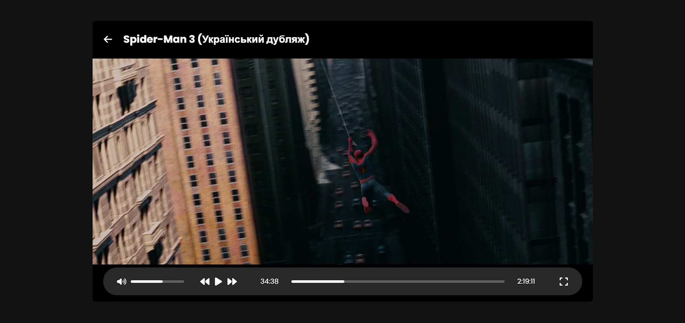

# Watch Together

- On Backend **(JavaScript)**
  - [Express](https://expressjs.com)
  - [express-validator](https://express-validator.github.io)
  - [Socket.IO](https://socket.io)
- On Frontend **(TypeScript)**
  - [React](https://react.dev)
  - [React Router](https://reactrouter.com)
  - [Axios](https://axios-http.com)
  - [Socket.IO](https://socket.io)
  - [Redux](https://redux.js.org) / [Redux Toolkit](https://redux-toolkit.js.org)
  - [Sass](https://sass-lang.com)
  - [react-icons](https://react-icons.github.io/react-icons)
  - [react-transition-group](https://reactcommunity.org/react-transition-group)

# 

# 

